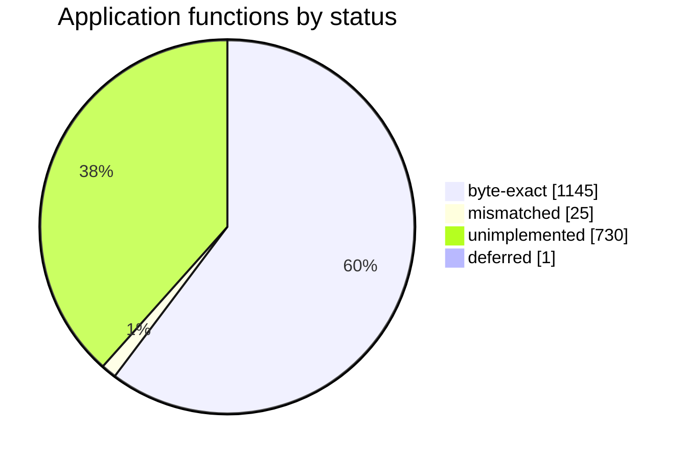

# GameServer.exe — Byte-Exact Decompilation

Reconstruct original-style C++ source for `GameServer.exe` and rebuild it with the
Borland C++ 5.5 toolchain so that the linked executable is **byte-for-byte identical**
to the reference binary:

```
MD5 (GameServer.exe) = 075fb5db1d6369bf488cd2ad0c715ddd
```

The reference is a 32-bit Windows GUI application built with **Borland C++Builder 5**
(statically linked VCL, no runtime Borland packages). Work proceeds **TASM-first**:
every machine-code region is first reproduced as reassemblable Turbo Assembler source
and proven against the reference, then lifted, unit by unit, into C++ translation
units that recompile to the same bytes.

The detailed roadmap lives in [PLAN.md](PLAN.md). Working instructions for
contributors and AI agents live in [AGENTS.md](AGENTS.md).

## Target fingerprint

| Property              | Value                                                              |
| --------------------- | ----------------------------------------------------------------- |
| File                  | `GameServer.exe`                                                  |
| Size                  | 1,733,120 bytes                                                   |
| MD5                   | `075fb5db1d6369bf488cd2ad0c715ddd`                                |
| Format                | PE32, `coff-i386`, GUI subsystem                                  |
| Compiler              | Borland C++ 5.5 (`bcc32.exe`), 32-bit, static                     |
| Linker                | Turbo Incremental Link 5.00 (`ilink32.exe`)                       |
| Assembler             | Turbo Assembler 5.3 (`tasm32.exe`)                                |
| Resource compiler     | Borland Resource Compiler 5.40 (`brcc32.exe`)                     |
| Entry point           | `0x00401000`                                                      |
| Image base            | `0x00400000`                                                      |
| Sections              | `.text .data .tls .rdata .idata .edata .rsrc .reloc`              |
| File/section align    | `0x200` / `0x1000`                                                |
| Header characteristic | `0x010e`                                                          |
| Build timestamp       | `0x50CBB124` (2012-12-14 23:07:16 UTC)                            |
| Imports               | 8 DLLs, 413 functions (see below)                                 |
| Exports               | 133 (65 unit `Initialize`/`Finalize` pairs, `_GUI`, etc.)         |

Imported DLLs: `ADVAPI32.DLL`, `COMCTL32.DLL`, `GDI32.DLL`, `KERNEL32.DLL`,
`OLE32.DLL`, `OLEAUT32.DLL`, `USER32.DLL`, `WSOCK32.DLL`. No Borland runtime DLLs
(`rtl50`, `vcl50`, `cc3250`) are imported, confirming the RTL and VCL are linked
statically rather than through runtime packages.

The executable is a TCP game server: the main form `TGUI` ("Endless Advanced Server")
hosts a `TServerSocket`, a BDE `TSession`/`TDatabase`/`TQuery` stack targeting MySQL
(alias `endless_database`, database `endless_db`), a `TTimer`, and a
`TApplicationEvents`. Two additional forms exist: `TLoginDialog` ("Database Login")
and `TPasswordDialog` ("Enter password"). The compiler emitted per-unit
module initializers/finalizers as exports, which gives a complete inventory of the
original translation units (see [PLAN.md](PLAN.md#translation-unit-inventory)).

## Repository layout

```
.
├── README.md                     # this file
├── AGENTS.md                     # agent/contributor workflow and build commands
├── PLAN.md                       # phased decompilation plan and inventory
├── Makefile                      # build driver (image, analyze, disasm, sanity, ...)
├── GameServer.exe                # reference target (untracked, gitignored)
├── GameServer.exe.md5            # expected hash (tracked)
├── docker/
│   └── Dockerfile                # Wine + Borland runner image
├── scripts/                      # container wrapper and PE tooling (see scripts/README.md)
├── tests/                        # harness fixtures (minimal VCL+BDE link check)
└── ref/
    ├── Borland5/                 # Borland C++Builder 5 toolchain (gitignored)
    ├── Borland_C++_Version_5_Programmers_Guide_1997.pdf
    └── calling_conventions.pdf   # Agner Fog, calling conventions and name mangling
```

Reconstruction sources (`src/`, `asm/`, `forms/`, `res/`) are added as the plan
progresses; the intended structure is described in
[PLAN.md](PLAN.md#proposed-repository-layout). `build/` and `analysis/` are
generated and gitignored.

## Requirements

- Docker (the Borland tools are Windows binaries and run under Wine in the image).
- The provided `ref/Borland5` toolchain tree and `GameServer.exe` reference binary.
- No native Borland install is needed; everything runs in the container.

## Quickstart

Build the runner image once:

```sh
docker build -t gameserver-borland-wine docker
```

Run any Borland tool through the container wrapper, which mounts the toolchain at
the absolute path its `.cfg` files expect
(`C:\Program Files (x86)\Borland\CBuilder5`) and the repository at `/work`. It
exports `$B` for tool paths and `$BZ`, a space-free path for `ilink32` arguments:

```sh
scripts/borland.sh 'wine "$B\Bin\bcc32.exe" -c -obuild/unit.obj tests/vcl_link.cpp'
```

Verify a build result against the reference:

```sh
md5 -q build/GameServer.exe        # must equal GameServer.exe.md5
```

The mount path is significant: `bcc32.cfg` and `ilink32.cfg` reference
`C:\Program Files (x86)\Borland\CBuilder5`, so mounting the toolchain anywhere else
requires passing `-I`/`-L` explicitly. `ilink32` also mishandles spaces on its
command line, which is why the wrapper provides the space-free `$BZ` path.

Convenience targets cover the harness (`scripts/README.md` has the details):

```sh
make image     # build the docker/Wine image
make analyze   # extract reference metadata and DFMs into analysis/target/
make disasm    # linear .text disassembly into analysis/target/
make sanity    # compile+link a minimal VCL+BDE app to validate the toolchain
make compare   # compare build/GameServer.exe against the reference
make normalize # apply the deterministic timestamp step
```

See [AGENTS.md](AGENTS.md) for the full command reference and link configuration.

## References

- `ref/Borland_C++_Version_5_Programmers_Guide_1997.pdf` — language, compiler and
  linker behavior for the exact toolchain version in use.
- `ref/calling_conventions.pdf` (Agner Fog) — 32-bit register/stack conventions,
  Borland name mangling (section 8.2), object-file formats, and exception/stack
  unwinding rules needed to express optimized code as TASM and C++.
- `ref/Borland5/` — compiler, assembler, linker, resource compiler, runtime (`Lib/`),
  headers (`Include/`), and the RTL/C++Builder sources including the startup module
  `Source/RTL/source/startup/c0nt.asm`.

## Status

Reconstruction is C++-first (TASM as a surgical fallback). The figures below are
generated by `scripts/track.py` from `analysis/target/functions.tsv`: every
function in the reference's non-library modules is classified as application
code, a compiler-emitted COMDAT, or a statically linked library member, then
scored against the compiler's own `-S` listings for that unit. Regenerate with
`make unitmap && make track`; the sheet is the single source of truth for
per-function progress, and [PLAN.md](PLAN.md) records phases, risks, the
outstanding cross-unit externs and the known-unconverged functions.

<!-- BEGIN GENERATED STATUS -->

**1145/1901 (60.2%)** application functions byte-exact (1901 app + compiler COMDATs; 474 library members excluded).



| Unit | functions | byte-exact | mismatched | unimplemented |
| --- | ---: | ---: | ---: | ---: |
| Mapcontrol | 279 | 102 | 2 | 175 |
| Packets | 248 | 61 | 12 | 174 |
| Players | 160 | 91 | 0 | 69 |
| Banned | 127 | 2 | 0 | 125 |
| Questengine | 123 | 104 | 0 | 19 |
| Shopvalues | 85 | 67 | 0 | 18 |
| Npcvalues | 80 | 64 | 3 | 13 |
| Mysqlcontrols | 72 | 61 | 1 | 10 |
| Msgboardcontrol | 57 | 43 | 0 | 14 |
| Itemvalues | 43 | 39 | 0 | 4 |
| Learnvalues | 41 | 29 | 3 | 9 |
| Settings | 40 | 35 | 0 | 5 |
| Innvalues | 39 | 34 | 0 | 5 |
| Questcounters | 36 | 31 | 0 | 5 |
| Skillvalues | 34 | 29 | 0 | 5 |
| Killcounters | 33 | 29 | 0 | 4 |
| Jukeboxcontrol | 32 | 13 | 0 | 19 |
| Questcounter | 32 | 29 | 0 | 3 |
| Weddings | 31 | 26 | 0 | 5 |
| Classvalues | 29 | 23 | 0 | 6 |
| Learnvalue | 26 | 22 | 0 | 4 |
| Player | 26 | 21 | 0 | 5 |
| Mysqltask | 21 | 18 | 0 | 3 |
| Npcvalue | 21 | 17 | 0 | 4 |
| Filecache | 18 | 14 | 0 | 4 |
| Serial | 18 | 14 | 0 | 4 |
| Shopvalue | 16 | 12 | 0 | 4 |
| Quest | 14 | 12 | 0 | 2 |
| Npccontrol | 13 | 9 | 1 | 3 |
| Queststate | 12 | 10 | 0 | 2 |
| Logins | 10 | 10 | 0 | 0 |
| Map | 8 | 8 | 0 | 0 |
| Mysqlthread | 8 | 7 | 0 | 1 |
| Mapchest | 7 | 6 | 0 | 1 |
| Gamecontrol | 6 | 3 | 3 | 0 |
| Chestcontrol | 4 | 2 | 0 | 2 |
| Newscontrol | 4 | 3 | 0 | 1 |
| Effectcontrol | 3 | 2 | 0 | 1 |
| Eventcontrol | 3 | 2 | 0 | 1 |
| Killcounter | 3 | 3 | 0 | 0 |
| Msgboard | 3 | 3 | 0 | 0 |
| Questcounterlist | 3 | 3 | 0 | 0 |
| Classvalue | 2 | 2 | 0 | 0 |
| Doorcontrol | 2 | 2 | 0 | 0 |
| Innvalue | 2 | 2 | 0 | 0 |
| Jukebox | 2 | 2 | 0 | 0 |
| Learnitem | 2 | 2 | 0 | 0 |
| Npc | 2 | 2 | 0 | 0 |
| Playercommand | 2 | 2 | 0 | 0 |
| Questtype | 2 | 2 | 0 | 0 |
| Skillvalue | 2 | 2 | 0 | 0 |
| Weaponmap | 2 | 2 | 0 | 0 |
| Wedding | 2 | 2 | 0 | 0 |
| Itemchest | 1 | 1 | 0 | 0 |
| Itemground | 1 | 1 | 0 | 0 |
| Itemvalue | 1 | 0 | 0 | 1 |
| Mapobject | 1 | 1 | 0 | 0 |
| Mapwarp | 1 | 1 | 0 | 0 |
| Npcdrop | 1 | 1 | 0 | 0 |
| Playerinventory | 1 | 1 | 0 | 0 |
| Playerquest | 1 | 1 | 0 | 0 |
| Playerskill | 1 | 1 | 0 | 0 |
| Shopcraft | 1 | 1 | 0 | 0 |
| Shopitem | 1 | 1 | 0 | 0 |

<!-- END GENERATED STATUS -->

