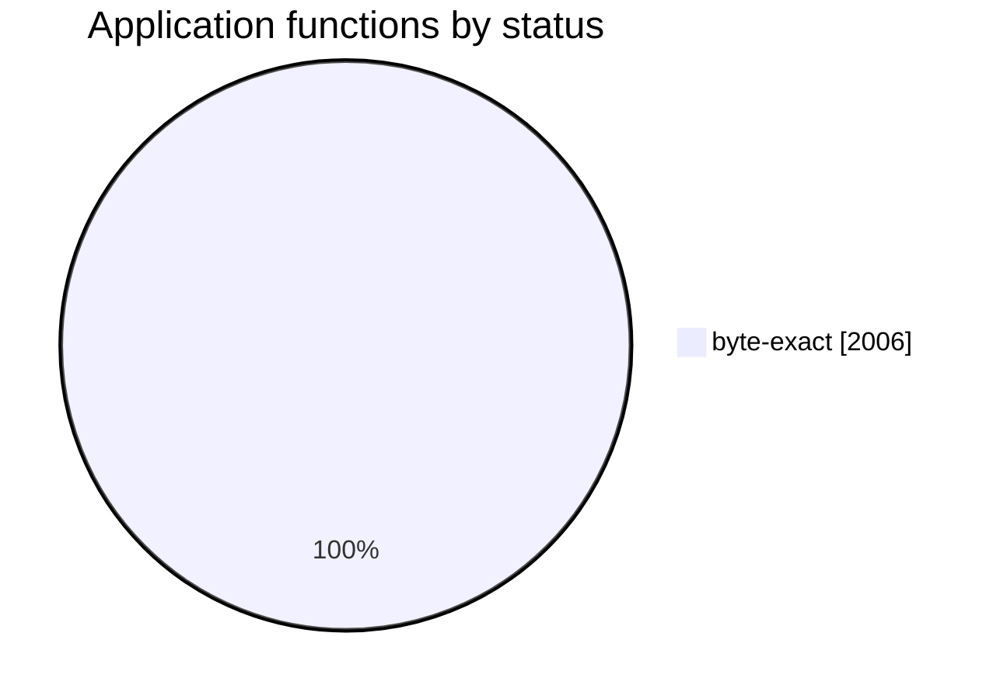

# GameServer.exe — Byte-Exact Decompilation

Reconstruct original-style C++ source for `GameServer.exe` and rebuild it with the
Borland C++ 5.5 toolchain so that the linked executable is **byte-for-byte identical**
to the reference binary:

```
MD5 (GameServer.exe) = 075fb5db1d6369bf488cd2ad0c715ddd
```

The reference is a 32-bit Windows GUI application built with **Borland C++Builder 5**
(statically linked VCL, no runtime Borland packages). The reconstruction is
**C++-first**: each original translation unit is rewritten in the Borland dialect,
compiled with `bcc32`, and scored against the reference disassembly until it
reproduces the exact machine code. No hand-written assembly is used.

The detailed roadmap lives in [PLAN.md](PLAN.md). Working instructions for
contributors and AI agents live in [AGENTS.md](AGENTS.md).

## Legal status and licensing

This repository is an independent reverse-engineering effort. Its purpose is
interoperability, preservation and study: it documents and reconstructs the
behaviour of a legacy version of the [Endless Online](https://www.endless-online.com)
v28 game server -- originally authored by Vult-r (<https://vult-r.com/>) -- so
that compatible, original software can be written against it. It is not
affiliated with, authorised by, or endorsed by Vult-r or Endless Online, and
any trademarks remain the property of their owners.

**Nothing proprietary is distributed here.** The reference `GameServer.exe`,
the Borland C++Builder 5 toolchain, and the resources extracted from the
reference (`forms/`, `res/`) are all gitignored. The build requires the user to
supply their own copy of the reference binary; no assets, executables, or
game data are included in this repository or its releases.

**Licensing.** The reconstruction harness — `scripts/`, the build files and
this documentation — is original work and is offered under the MIT licence
(see [LICENSE](LICENSE)). The reconstructed translation units in `src/` are
derivative works of the proprietary reference and are **not** licensed by this
project; no rights in the original program are claimed or granted. Do not use
this repository to distribute the reference binary or any of its assets.

## Target fingerprint

| Property              | Value                                                              |
| --------------------- | ----------------------------------------------------------------- |
| File                  | `GameServer.exe`                                                  |
| Size                  | 1,733,120 bytes                                                   |
| MD5                   | `075fb5db1d6369bf488cd2ad0c715ddd`                                |
| Format                | PE32, `coff-i386`, GUI subsystem                                  |
| Compiler              | Borland C++ 5.5 (`bcc32.exe`), 32-bit, static                     |
| Linker                | Turbo Incremental Link 5.00 (`ilink32.exe`)                       |
| Resource compiler     | Borland Resource Compiler 5.40 (`brcc32.exe`); reference only — the rebuild copies the reference `.rsrc` |
| Entry point           | `0x00401000`                                                      |
| Image base            | `0x00400000`                                                      |
| Sections              | `.text .data .tls .rdata .idata .edata .rsrc .reloc`              |
| File/section align    | `0x200` / `0x1000`                                                |
| Header characteristic | `0x010e`                                                          |
| Build timestamp       | `0x50CBB124` (2012-12-14 23:07:16 UTC)                            |
| Imports               | 8 DLLs, 413 functions (see below)                                 |
| Exports               | 133 (65 unit `Initialize`/`Finalize` pairs, `_GUI`, etc.)         |

Imported DLLs: `ADVAPI32.DLL`, `COMCTL32.DLL`, `GDI32.DLL`, `KERNEL32.DLL`,
`OLE32.DLL`, `OLEAUT32.DLL`, `USER32.DLL`, `WSOCK32.DLL`. No Borland runtime DLLs
(`rtl50`, `vcl50`, `cc3250`) are imported, confirming the RTL and VCL are linked
statically rather than through runtime packages.

The executable is a TCP game server: the main form `TGUI` ("Endless Advanced Server")
hosts a `TServerSocket`, a BDE `TSession`/`TDatabase`/`TQuery` stack targeting MySQL
(alias `endless_database`, database `endless_db`), a `TTimer`, and a
`TApplicationEvents`. Two additional forms exist: `TLoginDialog` ("Database Login")
and `TPasswordDialog` ("Enter password"). The compiler emitted per-unit
module initializers/finalizers as exports, which gives a complete inventory of the
original translation units (see [PLAN.md](PLAN.md#translation-unit-inventory)).

## Repository layout

```
.
├── README.md                     # this file
├── AGENTS.md                     # agent/contributor workflow and build commands
├── PLAN.md                       # phased decompilation plan and inventory
├── Makefile                      # build driver (image, analyze, disasm, sanity, ...)
├── GameServer.exe                # reference target (untracked, gitignored)
├── GameServer.exe.md5            # expected hash (tracked)
├── docker/
│   └── Dockerfile                # Wine + Borland runner image
├── src/                          # reconstructed C++ translation units (Unit.cpp / Unit.h)
├── scripts/                      # container wrapper and PE tooling (see scripts/README.md)
├── tests/                        # harness fixtures (minimal VCL+BDE link check)
└── ref/
    ├── Borland5/                 # Borland C++Builder 5 toolchain (gitignored)
    ├── Borland_C++_Version_5_Programmers_Guide_1997.pdf
    └── calling_conventions.pdf   # Agner Fog, calling conventions and name mangling
```

The reconstructed translation units live in `src/` (one `.cpp`/`.h` per original
unit). `forms/` and `res/` are derived from the reference and gitignored, as are
`build/` and `analysis/`.

## Requirements

- Docker (the Borland tools are Windows binaries and run under Wine in the image).
- The `ref/Borland5` toolchain tree (compiler, linker, headers and libraries).
- A reference `GameServer.exe` — your own copy of the target. It is gitignored;
  place it at the repository root or point `REF=` at it (see Quickstart).
- No native Borland install is needed; everything runs in the container.

## Quickstart

### 1. Provide the reference

The rebuild is driven by the reference binary. It is **not** tracked (all `*.exe`
are gitignored), so supply your own copy:

```sh
cp /path/to/your/GameServer.exe GameServer.exe
```

Any location works via `REF`, e.g. `REF=/path/to/GameServer.exe scripts/build.sh`.
The expected hash is in `GameServer.exe.md5`:

```
075fb5db1d6369bf488cd2ad0c715ddd  GameServer.exe
```

The Borland C++Builder 5 toolchain must be present at `ref/Borland5`.

### 2. Build the runner image

```sh
make image          # docker build -t gameserver-borland-wine docker
```

### 3. Analyze the reference and rebuild

```sh
make analyze        # metadata, DFMs and the unit table -> analysis/target/
scripts/build.sh    # compile every unit, link, normalize, copy .rsrc -> build/GameServer.exe
```

`scripts/build.sh` reads the unit link order from `analysis/target/units.tsv`, so
`make analyze` must run first. On the first build it also reconstructs
`build/GameServer.res` from the reference's `.rsrc` (`make extract` does that step
alone). `make build` is an alias for `scripts/build.sh`.

### 4. Verify

```sh
md5 -q build/GameServer.exe        # 075fb5db1d6369bf488cd2ad0c715ddd
make compare                       # section-by-section comparison; must print IDENTICAL
make verify                        # score every source function against the reference
```

### Running individual tools

The container wrapper mounts the toolchain at the absolute path its `.cfg` files
expect (`C:\Program Files (x86)\Borland\CBuilder5`) and the repository at `/work`,
and exports `$B` (tool paths) and `$BZ` (a space-free path for `ilink32` arguments):

```sh
scripts/borland.sh 'wine "$B\Bin\bcc32.exe" -c -obuild/unit.obj tests/vcl_link.cpp'
```

The mount path is significant: `bcc32.cfg` and `ilink32.cfg` reference
`C:\Program Files (x86)\Borland\CBuilder5`, so mounting the toolchain anywhere else
requires passing `-I`/`-L` explicitly. `ilink32` also mishandles spaces on its
command line, which is why the wrapper provides the space-free `$BZ` path.

Convenience targets cover the harness (`scripts/README.md` has the details):

```sh
make disasm    # linear .text disassembly into analysis/target/
make sanity    # compile+link a minimal VCL+BDE app to validate the toolchain
make normalize # apply the deterministic timestamp step
```

See [AGENTS.md](AGENTS.md) for the full command reference and link configuration.

## References

- `ref/Borland_C++_Version_5_Programmers_Guide_1997.pdf` — language, compiler and
  linker behavior for the exact toolchain version in use.
- `ref/calling_conventions.pdf` (Agner Fog) — 32-bit register/stack conventions,
  Borland name mangling (section 8.2), object-file formats, and exception/stack
  unwinding rules needed to read the reference disassembly.
- `ref/Borland5/` — compiler, linker, resource compiler, runtime (`Lib/`), headers
  (`Include/`), and the RTL/C++Builder sources including the startup module
  `Source/RTL/source/startup/c0nt.asm`.

## Status

**The rebuild is byte-identical to the reference**: from an empty `build/`,
`scripts/build.sh` produces `MD5 = 075fb5db1d6369bf488cd2ad0c715ddd`, and
`scripts/compare_pe.py GameServer.exe build/GameServer.exe` reports `IDENTICAL`.

Reconstruction is C++-first. The figures below are
generated by `scripts/track.py` from `analysis/target/functions.tsv`: every
function in the reference's non-library modules is classified as application
code, a compiler-emitted COMDAT, or a statically linked library member, then
scored against the compiler's own `-S` listings for that unit. Regenerate with
`make unitmap && make track`; the sheet is the single source of truth for
per-function progress, and [PLAN.md](PLAN.md) records phases, risks, the
outstanding cross-unit externs and the known-unconverged functions.

<!-- BEGIN GENERATED STATUS -->

**2006/2006 (100.0%)** application functions byte-exact (2006 app + compiler COMDATs; 506 library members excluded).

**684,938/684,938 (100.0%)** application BYTES byte-exact. `Player_HandlePacket` (228,416 bytes, **33.9% of all application code**) is now byte-exact, which is why the byte figure has moved close to the function figure.



| Unit | functions | byte-exact | stubbed | mismatched | unimplemented |
| --- | ---: | ---: | ---: | ---: | ---: |
| Mapcontrol | 279 | 279 | 0 | 0 | 0 |
| Packets | 246 | 246 | 0 | 0 | 0 |
| Mainform | 206 | 206 | 0 | 0 | 0 |
| Players | 160 | 160 | 0 | 0 | 0 |
| Questengine | 123 | 123 | 0 | 0 | 0 |
| Shopvalues | 86 | 86 | 0 | 0 | 0 |
| Npcvalues | 80 | 80 | 0 | 0 | 0 |
| Mysqlcontrols | 73 | 73 | 0 | 0 | 0 |
| Msgboardcontrol | 56 | 56 | 0 | 0 | 0 |
| Itemvalues | 44 | 44 | 0 | 0 | 0 |
| Learnvalues | 41 | 41 | 0 | 0 | 0 |
| Innvalues | 39 | 39 | 0 | 0 | 0 |
| Settings | 39 | 39 | 0 | 0 | 0 |
| Questcounters | 36 | 36 | 0 | 0 | 0 |
| Skillvalues | 34 | 34 | 0 | 0 | 0 |
| Jukeboxcontrol | 33 | 33 | 0 | 0 | 0 |
| Killcounters | 33 | 33 | 0 | 0 | 0 |
| Questcounter | 32 | 32 | 0 | 0 | 0 |
| Weddings | 31 | 31 | 0 | 0 | 0 |
| Classvalues | 29 | 29 | 0 | 0 | 0 |
| Learnvalue | 26 | 26 | 0 | 0 | 0 |
| Player | 26 | 26 | 0 | 0 | 0 |
| Mysqltask | 21 | 21 | 0 | 0 | 0 |
| Npcvalue | 21 | 21 | 0 | 0 | 0 |
| Filecache | 18 | 18 | 0 | 0 | 0 |
| Serial | 18 | 18 | 0 | 0 | 0 |
| Shopvalue | 16 | 16 | 0 | 0 | 0 |
| Quest | 14 | 14 | 0 | 0 | 0 |
| Npccontrol | 13 | 13 | 0 | 0 | 0 |
| Queststate | 12 | 12 | 0 | 0 | 0 |
| Logins | 10 | 10 | 0 | 0 | 0 |
| Map | 8 | 8 | 0 | 0 | 0 |
| Mysqlthread | 8 | 8 | 0 | 0 | 0 |
| Banned | 7 | 7 | 0 | 0 | 0 |
| Gamecontrol | 7 | 7 | 0 | 0 | 0 |
| Mapchest | 7 | 7 | 0 | 0 | 0 |
| Chestcontrol | 5 | 5 | 0 | 0 | 0 |
| Newscontrol | 5 | 5 | 0 | 0 | 0 |
| Effectcontrol | 4 | 4 | 0 | 0 | 0 |
| Eventcontrol | 4 | 4 | 0 | 0 | 0 |
| Doorcontrol | 3 | 3 | 0 | 0 | 0 |
| Killcounter | 3 | 3 | 0 | 0 | 0 |
| Learnitem | 3 | 3 | 0 | 0 | 0 |
| Msgboard | 3 | 3 | 0 | 0 | 0 |
| Questcounterlist | 3 | 3 | 0 | 0 | 0 |
| Weaponmap | 3 | 3 | 0 | 0 | 0 |
| Classvalue | 2 | 2 | 0 | 0 | 0 |
| Innvalue | 2 | 2 | 0 | 0 | 0 |
| Itemchest | 2 | 2 | 0 | 0 | 0 |
| Itemground | 2 | 2 | 0 | 0 | 0 |
| Itemvalue | 2 | 2 | 0 | 0 | 0 |
| Jukebox | 2 | 2 | 0 | 0 | 0 |
| Mapobject | 2 | 2 | 0 | 0 | 0 |
| Mapwarp | 2 | 2 | 0 | 0 | 0 |
| Npc | 2 | 2 | 0 | 0 | 0 |
| Npcdrop | 2 | 2 | 0 | 0 | 0 |
| Playercommand | 2 | 2 | 0 | 0 | 0 |
| Playerinventory | 2 | 2 | 0 | 0 | 0 |
| Playerquest | 2 | 2 | 0 | 0 | 0 |
| Playerskill | 2 | 2 | 0 | 0 | 0 |
| Questtype | 2 | 2 | 0 | 0 | 0 |
| Shopcraft | 2 | 2 | 0 | 0 | 0 |
| Shopitem | 2 | 2 | 0 | 0 | 0 |
| Skillvalue | 2 | 2 | 0 | 0 | 0 |
| Wedding | 2 | 2 | 0 | 0 | 0 |

<!-- END GENERATED STATUS -->

